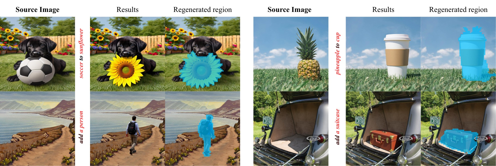
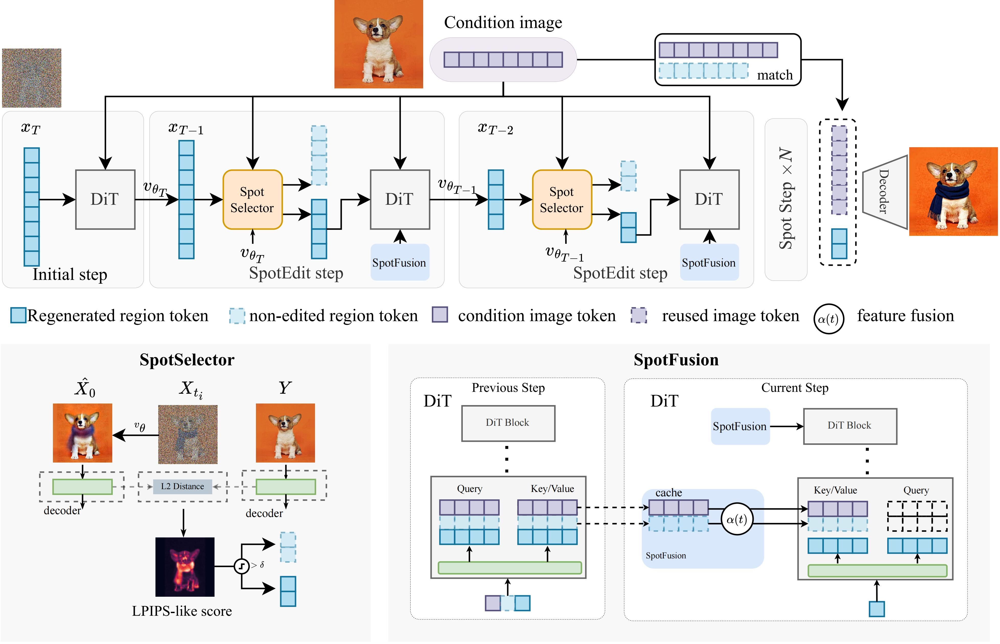
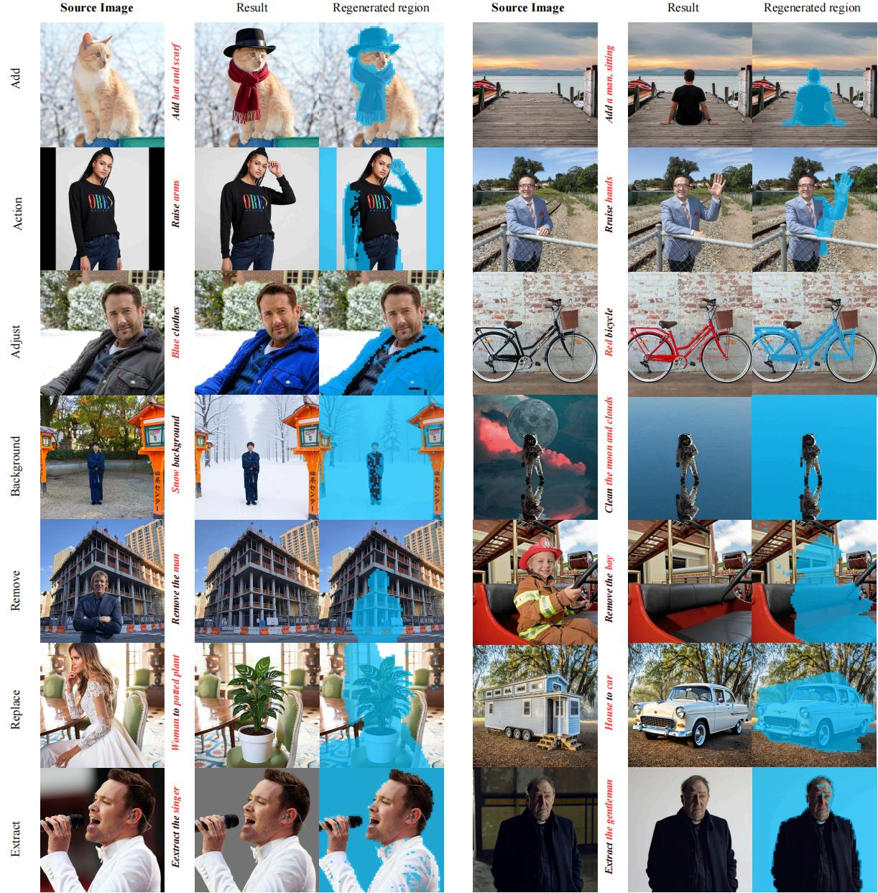

# SpotEdit: Selective Region Editing in Diffusion Transformers
<div align="center">
  </img>
  <br>
  <em>
      Examples of edited images by SpotEdit. The blue area reveals the regenerated region
  </em>
</div>
<br>

> **SpotEdit: Selective Region Editing in Diffusion Transformers**  
> 🖌️ [[arXiv]](https://arxiv.org/abs/XXXXX)  
>  
> Zhibin Qin<sup>1</sup>, Zhenxiong Tan<sup>1</sup>, Zeqing Wang<sup>1</sup>, Songhua Liu<sup>2</sup>, Xinchao Wang<sup>1</sup>  
> <sup>1</sup> National University of Singapore  
> <sup>2</sup> Shanghai Jiao Tong University  

## 📚 Overview
**SpotEdit** is a **training-free, region-aware acceleration framework** for instruction-based image editing with **Diffusion Transformers (DiTs)**.  
While most image editing tasks only modify small local regions, existing diffusion-based editors regenerate the entire image at every denoising step, leading to redundant computation and potential degradation in preserved areas. SpotEdit follows a simple principle: **edit only what needs to be edited**.

SpotEdit dynamically identifies **non-edited regions** during the diffusion process and skips unnecessary computation for these regions, while maintaining contextual coherence for edited regions through adaptive feature fusion. 

<div align="center">
  </img>
  <br>
  <em>
      The overview of SpotEdit pipeline
  </em>
</div>
<br>

## 🛠️ Setup

```bash
conda create -n spotedit python=3.10
conda activate spotedit
pip install -r requirements.txt
```

### Usage example
1. For Flux-Kontext basemodel: `example\flux.ipynb`
2. For Qwen-Image-Edit basemodel: `example\qwen.ipynb`

### Guidelines for Spotedit
1. Experiments and test examples are typically conducted at a resolution of 1024×1024. We recommend setting both input and output image sizes to 1024×1024 when running SpotEdit.

### limitation
1. SpotEdit is not intended for global edits that affect most or all regions of the image, such as full-scene style transfer or global color changes. In these cases, SpotEdit cannot reliably identify non-edited regions, and thus falls back to computation that is effectively equivalent to the original full-image diffusion process.

## Generated samples  
<div align="center">
  </img>
  <br>
  <em>
      more results of SpotEdit 
  </em>
</div>
<br>

## Ciatation

```bibtex
@misc{qin2026spotedit,
  title        = {SpotEdit: Selective Region Editing in Diffusion Transformers},
  author       = {Qin, Zhibin and Tan, Zhenxiong and Wang, Zeqing and Liu, Songhua and Wang, Xinchao},
  journal={arXiv preprint arXiv:XXXXXX}
}
```