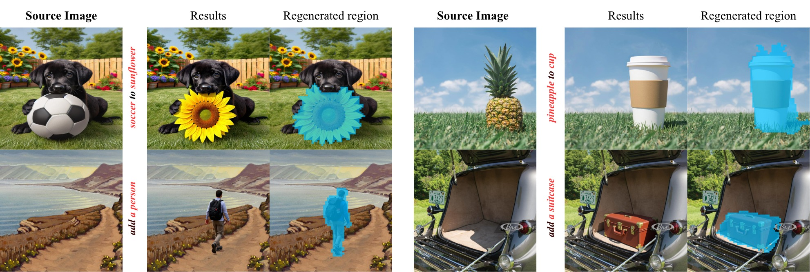
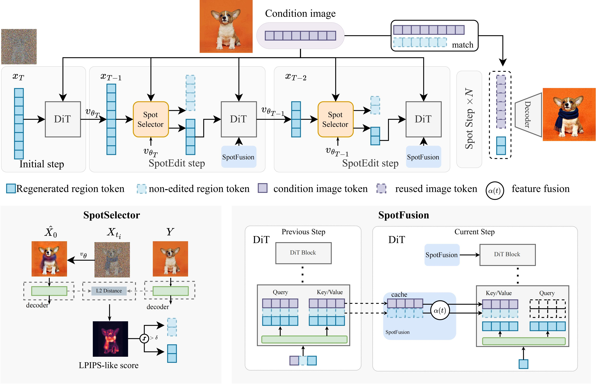
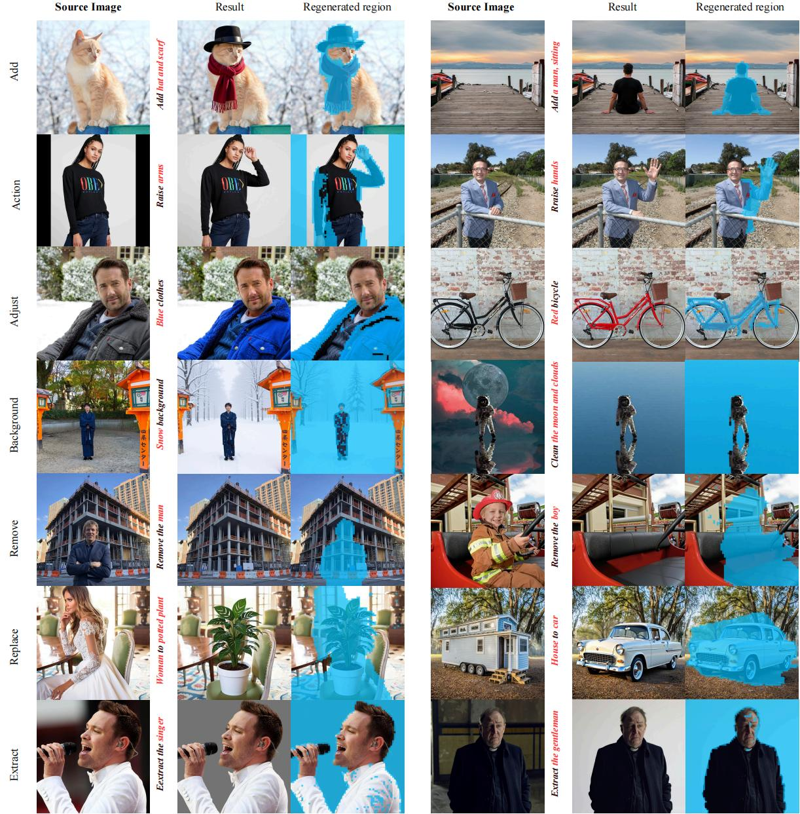

# SpotEdit: Selective Region Editing in Diffusion Transformers
<div align="center">
  </img>
  <br>
  <em>
      Examples of edited images by SpotEdit. The blue area reveals the regenerated region
  </em>
</div>
<br>
<a href="https://biangbiang0321.github.io/SpotEdit.github.io/"></a>
<a href="https://arxiv.org/abs/2512.22323"></a>

> **SpotEdit: Selective Region Editing in Diffusion Transformers**  
>  
> Zhibin Qin<sup>1</sup>, Zhenxiong Tan<sup>1</sup>, Zeqing Wang<sup>1</sup>, Songhua Liu<sup>2</sup>, Xinchao Wang<sup>1</sup>  
> <sup>1</sup> National University of Singapore  
> <sup>2</sup> Shanghai Jiao Tong University  

## 📚 Overview
**SpotEdit** is a **training-free, region-aware framework** for instruction-based image editing with **Diffusion Transformers (DiTs)**.  
While most image editing tasks only modify small local regions, existing diffusion-based editors regenerate the entire image at every denoising step, leading to redundant computation and potential degradation in preserved areas. SpotEdit follows a simple principle: **edit only what needs to be edited**.

SpotEdit dynamically identifies **non-edited regions** during the diffusion process and skips unnecessary computation for these regions, while maintaining contextual coherence for edited regions through adaptive feature fusion. 

<div align="center">
  </img>
  <br>
  <em>
      The overview of SpotEdit pipeline
  </em>
</div>
<br>

## 🛠️ Setup

```bash
conda create -n spotedit python=3.10
conda activate spotedit
pip install -r requirements.txt
```

### Usage example
Ready-to-run notebooks live in `examples/`, one per backbone. Each one loads the pipeline, runs SpotEdit alongside a full-compute baseline for comparison, and visualizes the reused (non-edited) region.
1. **FLUX.1-Kontext-dev** — `examples/flux.ipynb`
2. **Qwen-Image-Edit** (base) — `examples/qwen.ipynb`
3. **Qwen-Image-Edit-Plus** (2509 / 2511) — `examples/qwen_plus.ipynb`
4. **FLUX.2 [klein]** — `examples/flux2.ipynb` (needs `diffusers>=0.37`)

### Guidelines for Spotedit
1. Experiments and test examples are typically conducted at a resolution of 1024×1024. We recommend setting both input and output image sizes to 1024×1024 when running SpotEdit.
2. To help preserve the subject's proportions, it can be useful to feed a square canvas: scale the source to fit 1024×1024 while keeping its aspect ratio and pad the remainder (aspect-preserving letterbox), instead of stretching a non-square image to 1024×1024. The example notebooks do this by default.

### Key options (`SpotEditConfig`)

SpotEdit's behaviour is controlled through `SpotEditConfig`. Two options are worth highlighting:

**`reuse_mode` — how cached tokens are written back each denoising step**
- `"velocity"` *(default)*: at every step the reused (non-edited) tokens are guided toward the source image by setting their predicted velocity to `v = (x_t − x0_src) / σ`, so their `x0` prediction stays close to the source latent. The reused region then follows a similar trajectory to the recomputed region, which helps keep the boundary smooth and avoids relying on a hard paste at the end.
- `"overwrite"`: reused tokens keep the cached prediction during the loop and the source latents are hard-pasted onto them once, after the final step. This is simpler, though it can leave a more visible boundary between the reused and regenerated regions.

**`judge_method` — how the reuse / recompute split is decided**
Each step, SpotEdit assigns every token a per-token LPIPS-like edit score `d` (lower tends to mean unchanged, higher tends to mean edited).
- `"LPIPS"`: a token is reused when `d < threshold`, i.e. a fixed cutoff you set.
- `"LPIPS_kmeans"`: the cutoff is instead chosen adaptively per step by running 1-D k-means (k = 2, sum-of-squares split) over the token scores and reusing the lower-score cluster. This can help reduce the need to hand-tune `threshold` when the score scale differs across images or backbones; `threshold` is then kept mainly as a full-reuse safety fallback. It is used as the default for the Qwen-Image-Edit base model.

### limitation
1. SpotEdit is not intended for global edits that affect most or all regions of the image, such as full-scene style transfer or global color changes. In these cases, SpotEdit cannot reliably identify non-edited regions, and thus falls back to computation that is effectively equivalent to the original full-image diffusion process.

## Generated samples  
<div align="center">
  </img>
  <br>
  <em>
      more results of SpotEdit 
  </em>
</div>
<br>

## Ciatation

```bibtex
@artical{qin2025spotedit,
  title= {SpotEdit: Selective Region Editing in Diffusion Transformers},
  author= {Qin, Zhibin and Tan, Zhenxiong and Wang, Zeqing and Liu, Songhua and Wang, Xinchao},
  journal={arXiv preprint arXiv:2512.22323},
  year={2025}
}
```